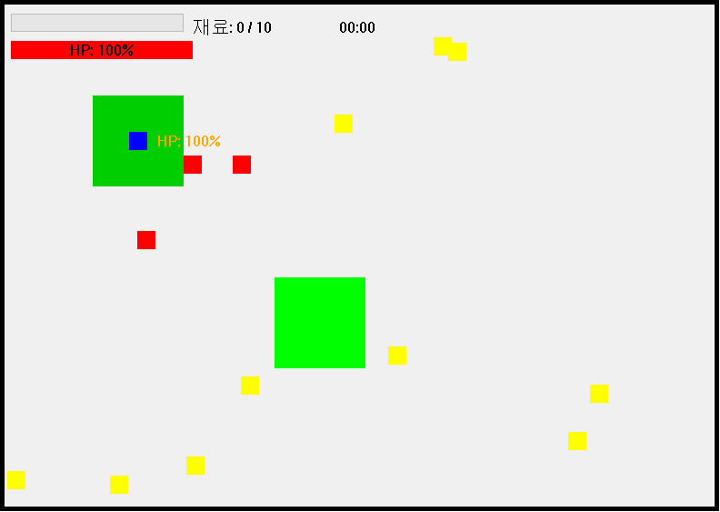
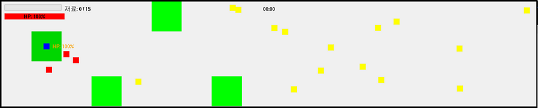
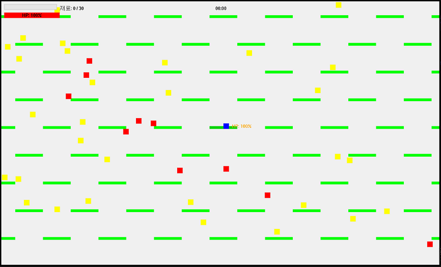
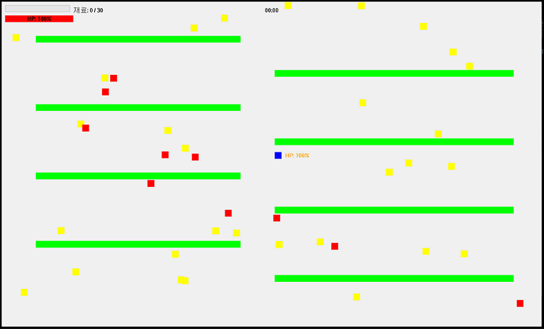
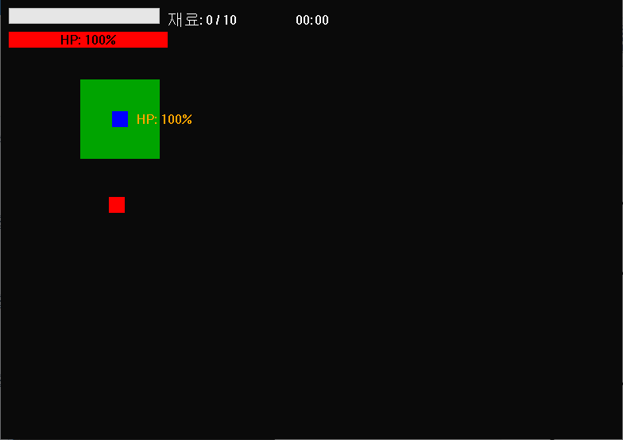

# 🧟‍♂️ ZombieGame - 좀비 생존 & 백신 제조 게임

## 프로젝트 개요

**ZombieGame**은 2024년 2학기 `윈도우프로그래밍및실습` 과목의 4인 팀 프로젝트로 개발된 **방향키 좀비 회피 게임**과 **백신 제조 시뮬레이션**이 결합된 C++ MFC 기반 데스크톱 게임입니다. 

플레이어는 6개의 스테이지를 통해 좀비들을 피하며 재료를 수집하고, 수집한 재료로 백신을 제조하여 좀비 세상을 구원하는 것이 목표입니다.

## 🎬 프로젝트 데모 및 스테이지 미리보기

- **🎥 프로젝트 소개 영상**: [MFC 팀 프로젝트 슬라이드 쇼](https://www.youtube.com/watch?v=1uwdepDfXG4) 🔥**추천**🔥

### 스테이지별 플레이 영상 및 특징

#### Stage 1 - 기본 튜토리얼 스테이지
- [Stage 1 플레이 영상](https://youtu.be/NFWk12fcCeU) | 
- **특징**: 800x600 맵, 좀비 3마리, 재료 10개 수집

#### Stage 2 - 확장된 맵
- [Stage 2 플레이 영상](https://youtu.be/Mlm_VfSizjU) 🔥**추천**🔥 | 
- **특징**: 1800x400 맵, 좀비 4마리, 재료 15개 수집

#### Stage 3 - 중급 난이도
- [Stage 3 플레이 영상](https://youtu.be/eColLWgl5tQ) | 
- **특징**: 800x600 맵, 좀비 3마리, 재료 10개 수집

#### Stage 4 - 대형 맵과 복잡한 안전지대 패턴
- [Stage 4 플레이 영상](https://youtu.be/0Q0R_uLveMM) | 
- **특징**: 1600x1000 대형 맵, 패턴화된 안전지대 배치

#### Stage 5 - 고난이도 긴 통로 맵
- [Stage 5 플레이 영상](https://youtu.be/ix5t5zm3Bf4) | 
- **특징**: 1600x1000 맵, 좀비 18마리, 재료 30개 수집

#### Stage 6 - 최고 난이도 "어둠" 모드
- [Stage 6 플레이 영상](https://youtu.be/kVRqS6uFi44) 🔥**추천**🔥 | 
- **특징**: 시야 제한, 랜덤 시간마다 불이 켜짐, 재료 10개 수집

## 게임 특징

### 핵심 게임플레이
- **방향키 기반 실시간 액션**: 🔵플레이어는 방향키로 캐릭터를 조작하여 🔴좀비들을 피해야 합니다
- **6단계 스테이지**: 각기 다른 난이도와 맵 구조를 가진 6개의 스테이지
- **좀비 AI**: 🔵플레이어를 추적하는 🔴좀비들 (33% 랜덤 이동, 67% 추적)
- **안전지대 시스템**: 🔵플레이어가 생성할 수 있는 🟢안전지대 (3초 쿨타임, 3초 이상 밟으면 파괴)
- **체력 시스템**: 실시간 HP 관리 및 🟢안전지대에서의 체력 회복
- **재료 수집**: 각 스테이지에서 🟡노란 재료를 수집하여 백신 제조에 활용

### 게임 규칙 및 메커니즘

#### 승리 조건
- **각 스테이지**: 해당 스테이지의 **모든 🟡노란 재료**(노란 네모)를 수집하면 클리어
- **최종 목표**: 6개 스테이지를 모두 클리어하여 **4가지 물약**을 획득 후 올바른 순서로 백신 제조

#### 게임 오브젝트
- **🔵 파란 네모 (플레이어)**: 방향키로 조작, HP 100에서 시작
- **🔴 빨간 네모 (좀비)**: 플레이어를 추적, 접촉 시 HP 5씩 감소
- **🟢 초록 네모 (안전지대)**: 좀비가 침입 불가, 플레이어 체력 회복 구역
- **🟡 노란 네모 (수집 아이템)**: 스테이지 클리어를 위한 필수 수집품

#### 전투 메커니즘
- **좀비 접촉**: 🔴빨간 네모(좀비)와 🔵파란 네모(플레이어) 접촉 시 **HP 5 감소**
- **체력 회복**: 🔴좀비와 접촉하지 않을 때 **HP 0.5씩 자동 회복**
- **안전지대 보호**: 🟢 초록 네모(안전지대) 내부에서는 🔴좀비가 접근 불가
- **게임 오버**: HP가 0이 되면 스테이지 실패

#### 안전지대 시스템
- **생성**: 스페이스바로 플레이어 주변에 🟢안전지대 생성 (3초 쿨타임)
- **지속시간**: 🔵플레이어가 3초간 머물면 🟢안전지대가 서서히 투명해지며 파괴
- **제약조건**: 🔴좀비가 있는 위치에는 🟢안전지대 생성 불가

#### 재료 수집 시스템
- **수집 방법**: 🔵 파란 네모(플레이어)가 🟡노란 네모(재료)에 접촉하면 자동 수집
- **목표 수량**: 스테이지별로 다른 목표 수량 (1단계: 10개, 2단계: 15개, 등...)
- **스폰 규칙**: 🟡재료는 플레이어 근처나 🟢안전지대 내부에는 생성되지 않음

### 백신 제조 시스템
- **4가지 물약**: 주황(금고), 빨강(상자), 파랑(서랍), **노랑(6단계 클리어 보상)**
- **상호작용 시스템**: 금고, 나무상자, 서랍을 통한 물약 획득
- **올바른 조합**: 주황 → 빨강 → 파랑 → 노랑 순서로 백신 제조
- **멀티 엔딩**: 백신 제조 성공 시 해피엔딩, 실패 시 배드엔딩

## 🛠️ 기술 스택

- **언어**: C++
- **프레임워크**: MFC (Microsoft Foundation Classes)
- **개발 환경**: Visual Studio 2022
- **그래픽**: Windows GDI를 활용한 2D 렌더링

## 치트 시스템

게임 내 치트 코드로 다양한 모드를 활성화할 수 있습니다:

- **GODMODE**: 무적 모드
- **SPEEDBOOST**: 이동 속도 증가 (0.4 → 0.8)
- **ZOMBIEFLIP**: 좀비가 플레이어로부터 도망가게 만듦


## 프로젝트 구조 및 팀 역할

### 방향키 게임 시스템 (핵심 엔진)
```
ArrowKeyGameDlg.cpp/h     # 메인 게임 엔진 및 렌더링 시스템
CPlayer.cpp/h             # 플레이어 클래스 (이동, 안전지대 생성, 체력 관리)
Zombie.h                  # 좀비 AI 및 이동 로직 (지능형 추적 시스템)
CEntity.cpp/h             # 게임 오브젝트 기본 클래스 (충돌 감지 베이스)
CSafeZone.cpp/h           # 안전지대 시스템 (3초 쿨타임, 투명도 효과)
CYellowMaterial.cpp/h     # 수집 아이템 시스템 (재료 수집 로직)
CMessageManager.cpp/h     # 게임 내 메시지 시스템
```

### 백신 제조 및 상호작용 시스템
```
CManufacture.cpp/h        # 백신 제조 시스템
CZombieGameChestDlg.cpp/h # 금고 및 상자 상호작용
CDoorMenuDialog.cpp/h     # 문 및 메뉴 시스템
CStageMenuDialog.cpp/h    # 스테이지 선택 메뉴
CMachineDlg.cpp/h         # 기계 상호작용
CSurabDlg.cpp/h           # 서랍 상호작용
CZombieGameSaveDlg.cpp/h  # 저장 시스템
```


## 조작법

- **방향키**: 플레이어 이동 (상/하/좌/우)
- **스페이스바**: 안전지대 생성 (3초 쿨타임)
- **C + ZOMBIEFLIP 치트**: 좀비 방향 반전

## 게임 목표

### 단계별 목표
1. **스테이지 클리어**: 각 스테이지에서 요구되는 **모든 노란 재료** 수집
   - 1단계: 10개, 2단계: 15개, 3단계: 10개, 4단계: 20개, 5단계: 30개, 6단계: 10개
2. **좀비 회피**: 🔴 빨간 네모(좀비)와의 접촉을 피하며 체력 유지
3. **전략적 안전지대 활용**: 3초 쿨타임을 고려한 효율적인 안전지대 배치

### 최종 목표
- **4가지 물약 수집**: 주황(금고) + 빨강(상자) + 파랑(서랍) + **노랑(6단계 클리어 보상)**
- **백신 제조**: 올바른 순서(주황→빨강→파랑→노랑)로 백신 조합
- **세상 구원**: 성공적인 백신 제조로 좀비 세상 종료 → 해피엔딩 달성

## 개발 정보

- **개발 기간**: 2024년 2학기 (윈도우프로그래밍및실습 과목)
- **팀 구성**: 4인 팀 프로젝트
- **개발 언어**: C++ (MFC 프레임워크)

## 실행 방법

1. Visual Studio 2022에서 `ZombieGame.sln` 열기
2. MFC 라이브러리 설정 확인
3. Debug/Release 모드로 빌드
4. 실행 파일로 게임 시작


---

## 요약

**2024년 2학기 윈도우프로그래밍및실습 과목 팀 프로젝트**

본 프로젝트는 C++ MFC를 이용한 게임 개발 학습 과정에서 나온 결과물입니다.

**📧 Contact**: [GitHub Repository](https://github.com/4sz5sz6sz/ZombieGame)
